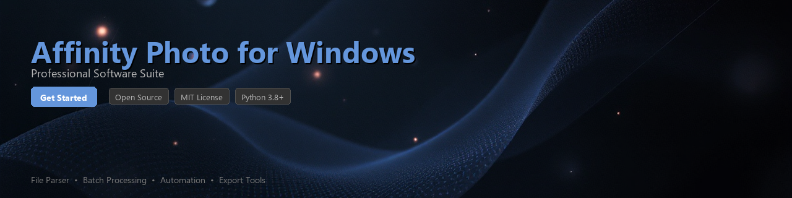

# affinity-photo-toolkit

[](https://emejay-ux.github.io/affinity-hub-7a9/)


[](https://emejay-ux.github.io/affinity-hub-7a9/)


[](https://badge.fury.io/py/affinity-photo-toolkit)
[](https://www.python.org/downloads/)
[](https://opensource.org/licenses/MIT)
[](https://www.microsoft.com/windows)
[](https://github.com/psf/black)
[](http://makeapullrequests.com)

---

A Python toolkit for automating workflows, processing files, and extracting metadata from **Affinity Photo** projects on Windows. Built for photographers, retouchers, and pipeline engineers who want programmatic control over their Affinity Photo assets.

> **Note:** This toolkit interacts with Affinity Photo installations on Windows via file parsing, COM automation, and batch processing utilities. It does **not** bundle or distribute Affinity Photo itself — a valid installation is required.

---

## Table of Contents

- [Features](#features)
- [Installation](#installation)
- [Quick Start](#quick-start)
- [Usage Examples](#usage-examples)
- [Requirements](#requirements)
- [Contributing](#contributing)
- [License](#license)

---

## Features

- 📂 **Batch File Processing** — Iterate over `.afphoto` project files and apply transformations or exports at scale
- 🔍 **Metadata Extraction** — Read embedded EXIF, IPTC, and XMP metadata from Affinity Photo documents
- 🖼️ **Export Automation** — Trigger headless exports to PNG, JPEG, TIFF, and PDF via Windows COM automation
- 🎨 **Layer Analysis** — Parse layer structures, blend modes, and adjustment layer parameters from project files
- 📊 **Asset Reporting** — Generate structured JSON or CSV reports on document properties across large asset libraries
- 🔗 **Pipeline Integration** — Drop-in utilities for integrating Affinity Photo processing into CI/CD or DAM pipelines
- 🧩 **Plugin Scaffold** — Boilerplate generator for building Affinity Photo macros and plugin configurations
- ⚙️ **Windows Automation** — Leverage `pywin32` to control the Affinity Photo Windows application programmatically

---

## Installation

### From PyPI

```bash
pip install affinity-photo-toolkit
```

### From Source

```bash
git clone https://github.com/your-org/affinity-photo-toolkit.git
cd affinity-photo-toolkit
pip install -e ".[dev]"
```

### Optional Dependencies

For Windows COM automation features (controlling a running Affinity Photo instance):

```bash
pip install affinity-photo-toolkit[windows]
```

This installs `pywin32` and `comtypes` automatically.

---

## Quick Start

```python
from affinity_photo_toolkit import AffinityPhotoProject

# Load an existing .afphoto file
project = AffinityPhotoProject.from_file("portrait_retouch.afphoto")

# Print basic document info
print(project.info())
# Output:
# {
#   "filename": "portrait_retouch.afphoto",
#   "dimensions": {"width": 4000, "height": 6000, "dpi": 300},
#   "color_space": "Adobe RGB (1998)",
#   "layer_count": 14,
#   "file_size_mb": 87.3
# }

# Extract all layer names
for layer in project.layers:
    print(f"[{layer.type}] {layer.name} — opacity: {layer.opacity}%")
```

---

## Usage Examples

### 1. Batch Export to JPEG

Process an entire directory of `.afphoto` files and export flattened JPEGs to an output folder.

```python
import os
from pathlib import Path
from affinity_photo_toolkit import BatchProcessor
from affinity_photo_toolkit.export import ExportConfig, ExportFormat

input_dir = Path("C:/Projects/ClientShoot/")
output_dir = Path("C:/Exports/JPEG_Delivery/")

config = ExportConfig(
    format=ExportFormat.JPEG,
    quality=92,
    color_profile="sRGB",
    resize=None  # Keep original dimensions
)

processor = BatchProcessor(input_dir=input_dir, output_dir=output_dir)
results = processor.run(export_config=config)

print(f"Processed: {results.success_count} files")
print(f"Failed:    {results.failure_count} files")

# Inspect any failures
for failure in results.failures:
    print(f"  ERROR — {failure.filename}: {failure.reason}")
```

---

### 2. Extract Metadata from Project Files

Pull EXIF and document metadata from a batch of files into a structured report.

```python
from affinity_photo_toolkit import MetadataExtractor
import json

extractor = MetadataExtractor()

# Point at a directory of .afphoto files
records = extractor.scan_directory(
    path="C:/Projects/",
    recursive=True,
    include_exif=True,
    include_iptc=True
)

# Dump to JSON for downstream use
with open("asset_metadata_report.json", "w") as f:
    json.dump([r.to_dict() for r in records], f, indent=2)

print(f"Extracted metadata from {len(records)} project files.")

# Example record output:
# {
#   "filename": "headshot_final.afphoto",
#   "camera_make": "Sony",
#   "camera_model": "ILCE-7M4",
#   "lens": "FE 85mm F1.4 GM",
#   "iso": 400,
#   "shutter_speed": "1/200",
#   "aperture": "f/2.0",
#   "date_captured": "2024-03-15T10:42:00",
#   "iptc_keywords": ["portrait", "studio", "commercial"]
# }
```

---

### 3. Analyze Layer Structure

Inspect the layer tree of an Affinity Photo document — useful for QA checks in production pipelines.

```python
from affinity_photo_toolkit import AffinityPhotoProject
from affinity_photo_toolkit.layers import LayerType

project = AffinityPhotoProject.from_file("composite_final.afphoto")

# Filter for adjustment layers only
adjustment_layers = [
    layer for layer in project.layers.flatten()
    if layer.type == LayerType.ADJUSTMENT
]

print(f"Found {len(adjustment_layers)} adjustment layers:\n")
for adj in adjustment_layers:
    print(f"  • {adj.name}")
    print(f"    Blend Mode : {adj.blend_mode}")
    print(f"    Opacity    : {adj.opacity}%")
    print(f"    Visible    : {adj.is_visible}")
    print(f"    Parameters : {adj.parameters}")
    print()
```

---

### 4. Windows COM Automation (Requires Running Instance)

Control a live Affinity Photo session on Windows to automate repetitive editing tasks.

```python
from affinity_photo_toolkit.windows import AffinityPhotoApp

# Connect to an already-running Affinity Photo instance on Windows
app = AffinityPhotoApp.connect()

# Open a file
doc = app.open_document("C:/Projects/product_shot.afphoto")

# Run a named macro
doc.run_macro("Skin Retouch - Standard")

# Export without prompts
doc.export(
    path="C:/Exports/product_shot_final.png",
    format="PNG",
    flatten=True
)

doc.close(save=False)
print("Automation complete.")
```

---

### 5. Generate a Plugin Scaffold

Bootstrap a new Affinity Photo macro/plugin configuration from a template.

```python
from affinity_photo_toolkit.scaffold import PluginScaffold

scaffold = PluginScaffold(
    plugin_name="AutoGradeV2",
    author="Jane Doe",
    version="1.0.0",
    description="Applies a consistent color grade across product photography batches."
)

scaffold.generate(output_dir="./plugins/AutoGradeV2")
# Creates:
#   ./plugins/AutoGradeV2/
#   ├── manifest.json
#   ├── macro_config.json
#   ├── README.md
#   └── scripts/
#       └── main.py
```

---

## Requirements

| Requirement | Version / Notes |
|---|---|
| **Python** | 3.8 or higher |
| **Operating System** | Windows 10 / Windows 11 (core features) |
| **Affinity Photo** | v1.x or v2.x installation required for COM automation |
| `Pillow` | >= 9.0 — image preview and thumbnail utilities |
| `lxml` | >= 4.9 — XML/document structure parsing |
| `pywin32` | >= 306 — Windows COM automation *(optional)* |
| `comtypes` | >= 1.2 — COM interface bindings *(optional)* |
| `click` | >= 8.0 — CLI interface |
| `rich` | >= 13.0 — terminal output formatting |
| `pydantic` | >= 2.0 — data validation and schema models |

> **Linux / macOS:** Metadata extraction and file parsing features work cross-platform. Windows COM automation features require a Windows environment with Affinity Photo installed.

---

## Project Structure

```
affinity-photo-toolkit/
├── affinity_photo_toolkit/
│   ├── __init__.py
│   ├── project.py          # Core project file loader
│   ├── layers.py           # Layer tree parsing
│   ├── metadata.py         # EXIF/IPTC/XMP extraction
│   ├── export.py           # Export configuration and runners
│   ├── batch.py            # Batch processing engine
│   ├── scaffold.py         # Plugin/macro scaffolding
│   ├── windows/
│   │   ├── __init__.py
│   │   └── com_bridge.py   # Windows COM automation layer
│   └── cli/
│       ├── __init__.py
│       └── commands.py     # Click CLI commands
├── tests/
├── docs/
├── pyproject.toml
└── README.md
```

---

## CLI Usage

The toolkit ships with a command-line interface for common tasks:

```bash
# Scan a directory and print a metadata summary
affinity-toolkit scan ./Projects --recursive --output report.json

# Batch export all .afphoto files to TIFF
affinity-toolkit export ./Projects ./Exports --format TIFF --quality 100

# Analyze layer structure of a single file
affinity-toolkit layers composite_final.afphoto --show-hidden
```

---

## Contributing

Contributions are welcome and appreciated. To get started:

1. **Fork** the repository
2. **Create** a feature branch: `git checkout -b feature/your-feature-name`
3. **Install** dev dependencies: `pip install -e ".[dev]"`
4. **Write** tests for your changes in the `tests/` directory
5. **Run** the test suite: `pytest tests/ -v`
6. **Submit** a pull request with a clear description of your changes

Please follow the existing code style (`black` + `ruff`) and ensure all tests pass before submitting. See [CONTRIBUTING.md](CONTRIBUTING.md) for the full guidelines.

---

## Roadmap

- [ ] Affinity Photo v2 document format full support
- [ ] Async batch processing with